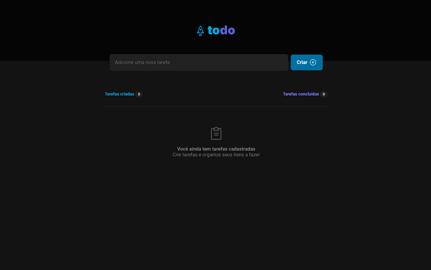
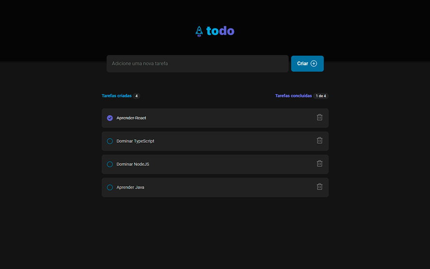

<h1 align="center"> Desafio REACT </h1>

Desafio, feito com estudos e tecnologias que aprendi no curso.

  <a href="#-tecnologias">Tecnologias</a>&nbsp;&nbsp;&nbsp;|&nbsp;&nbsp;&nbsp;
  <a href="#-projeto">Projeto</a>&nbsp;&nbsp;&nbsp;|&nbsp;&nbsp;&nbsp;
  <a href="#-layout">Layout</a>&nbsp;&nbsp;&nbsp;|&nbsp;&nbsp;&nbsp;
  <a href="#memo-licença">Licença</a>

  

 

  

  

## 🚀 Tecnologias

Esse projeto foi desenvolvido com as seguintes tecnologias:

- HTML e CSS
- JavaScript(React) e JSON
- TypeScript
- [Node e NPM](https://nodejs.org/)
- [Vite](https://vitejs.dev/)

## 💻 Projeto

O ToDo é uma lista onde você consegue fazer a lista de afazeres que você precisava, onde é possível criar uma tarefa, marcar as que já foram feitas e excluir as que você não precisa mais visualizar. E essa lista é salva no computador do usuário, não sendo apagada quando fechar a página.

## 🔖 Layout

Você pode visualizar o layout do projeto através [DESSE LINK](https://www.figma.com/file/ylTOvYpwad5azOFVTZiRx1/ToDo-List-(Copy)?node-id=43%3A88&t=FLvPWdmMwZdGYDGQ-1). É necessário ter conta no [Figma](https://figma.com) para acessá-lo.

## :memo: Licença

Esse projeto está sob a licença MIT.
